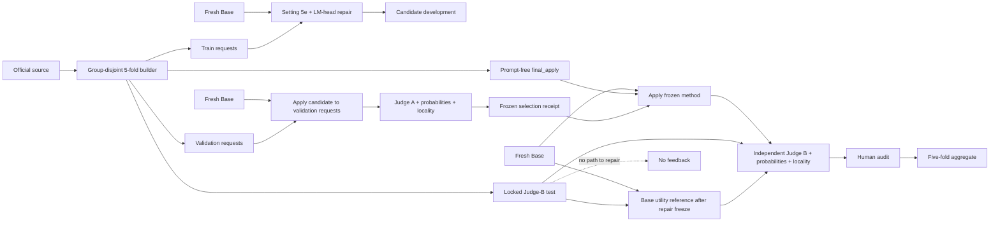

# Leakage-controlled LLM1/LLM2 unlearning

This workflow implements Setting 5e plus active LM-head repair with a
fact/author-disjoint five-fold protocol, a development judge (Judge A), an
independent final judge (Judge B), model-native probability/locality metrics,
and a required human audit.

It supports MCF first, then ZsRE, then TOFU.

## What “train/validation/test” means for unlearning

A held-out fact cannot reasonably be expected to disappear unless the
unlearning algorithm receives a deletion request for that fact. The split is
therefore at the **method-evaluation** level:

1. `train`: use deletion requests to develop candidate configurations.
2. `validation`: start again from the same Base model, apply validation
   deletion requests, and let Judge A plus probability/utility metrics select a
   preregistered candidate.
3. `final_apply`: after selection is frozen, start again from Base and apply
   held-out deletion requests. This prompt-free bundle contains no Judge-B
   questions.
4. `test`: only after the final-application receipt is frozen, Judge B
   evaluates exact-request efficacy plus new direct, indirect, cloze,
   multiple-choice, adversarial, and held-out paraphrase prompts. Judge B also
   scores the untouched Base on the locked utility/locality cases so the final
   utility tolerance is measured, not assumed.

The final model is never a validation-edited checkpoint.



Judge A is an outer-loop selection signal, not a differentiable loss and not a
replacement for model-native evidence.

## Leakage controls

- MCF and ZsRE are grouped conservatively by subject/entity. TOFU is grouped
  by complete 20-question author profiles.
- Semantically identical forget/retain facts are rejected or deterministically
  replaced during official sampling.
- MCF official paraphrase 0 is development-only and paraphrase 1 is
  final-only.
- ZsRE’s single official `rephrase` is final-only; validation uses multiple
  deterministic paraphrases.
- TOFU’s forget and retain rows are mapped back to `full` before author-level
  splitting.
- Exact duplicate locality prompts are deduplicated globally. Prompts with one
  text but conflicting answers are removed.
- `final_apply.json` contains runtime requests but no test prompts.
- `test.json` contains Judge-B cases but no runtime materialization or raw
  apply records.
- Bundle and materialized-file SHA-256 hashes are verified before use.
- Candidate selection copies test/apply commitments without opening either
  artifact.
- Final evaluation requires both a frozen selection receipt and a
  final-application receipt.
- Judge B must use a different judge ID and model identity from Judge A;
  moving the same model to another endpoint does not qualify.
- A final-test output directory is one-shot by default.
- The manual-audit sample is selected from immutable case IDs, stratified by
  behavior and prompt style, before LLM1 outputs or Judge-B decisions exist.

Generated split data live under `data/controlled_unlearning/` and are ignored
by Git because they are reproducible and large.

## 1. Build and audit the datasets

Run in `semantic-unlearning/`:

```bash
python scripts/build_controlled_unlearning_protocol.py \
  --dataset mcf \
  --output-dir data/controlled_unlearning \
  --seed 0

python scripts/audit_controlled_unlearning_protocol.py \
  --manifest data/controlled_unlearning/mcf/manifest.json
```

Then ZsRE:

```bash
python scripts/build_controlled_unlearning_protocol.py \
  --dataset zsre \
  --output-dir data/controlled_unlearning \
  --seed 0

python scripts/audit_controlled_unlearning_protocol.py \
  --manifest data/controlled_unlearning/zsre/manifest.json
```

Then TOFU:

```bash
python scripts/build_controlled_unlearning_protocol.py \
  --dataset tofu \
  --output-dir data/controlled_unlearning \
  --seed 0

python scripts/audit_controlled_unlearning_protocol.py \
  --manifest data/controlled_unlearning/tofu/manifest.json
```

If the installed `datasets`/`fsspec` combination rejects the TOFU Hub glob,
the builder falls back to the raw JSON files declared by the official dataset
card. To avoid network access entirely, provide a directory containing
`full.json`, `forget05.json`, `retain95.json`, `real_authors.json`, and
`world_facts.json`:

```bash
python scripts/build_controlled_unlearning_protocol.py \
  --dataset tofu \
  --tofu-data-dir /path/to/tofu-json \
  --output-dir data/controlled_unlearning \
  --seed 0
```

Default per-fold primary counts are:

| Dataset | Train forget | Validation forget | Final forget | Train retain | Validation retain | Final retain |
|---|---:|---:|---:|---:|---:|---:|
| MCF | 30 | 10 | 10 | 600 | 200 | 200 |
| ZsRE | 30 | 10 | 10 | 600 | 200 | 200 |
| TOFU | 120 | 40 | 40 | 600 | 200 | 200 |

For TOFU, 120/40/40 means 6/2/2 complete forget authors.

## 2. Configure LLM1 and both judges

Copy the relevant example and replace the base-model path:

```bash
cp config/controlled_unlearning/mcf_setting5e_active.example.json \
  config/controlled_unlearning/mcf_candidate_v1.json
```

Candidate templates:

- `config/controlled_unlearning/mcf_setting5e_active.example.json`
- `config/controlled_unlearning/zsre_setting5e_active.example.json`
- `config/controlled_unlearning/tofu_setting5e_active.example.json`

Copy and edit the judge templates:

- `config/controlled_unlearning/judge_a.example.json`
- `config/controlled_unlearning/judge_b.example.json`

They accept any OpenAI-compatible `/chat/completions` service. Put only the
environment-variable name in JSON; never put a key in the repository:

```bash
export JUDGE_A_API_KEY='...'
export JUDGE_B_API_KEY='...'
```

Judge B must use a different model identity and judge ID from Judge A.

## 3. Judge-A-guided candidate repair

Define all candidate specs before the search. Copy a template, change
`candidate_id`, and vary only preregistered repair/training settings. For MCF
fold 0:

```bash
python scripts/run_controlled_judge_guided_search.py \
  --development-bundle data/controlled_unlearning/mcf/fold_0/development.json \
  --candidate-spec config/controlled_unlearning/mcf_candidate_v1.json \
  --candidate-spec config/controlled_unlearning/mcf_candidate_v2.json \
  --judge-a-config config/controlled_unlearning/judge_a.json \
  --utility-tolerance 0.02 \
  --locality-tolerance 0.02 \
  --output-dir outputs/controlled/mcf/fold_0/search
```

The search:

1. writes a candidate-menu preregistration before model execution;
2. evaluates Base on validation utility;
3. runs each candidate on the train requests for development diagnostics;
4. discards that checkpoint, then applies every candidate to the same
   validation requests from a fresh Base;
5. runs Judge A plus answer-probability/locality scoring;
6. ranks forgetting by the strict fraction of facts that pass every validation
   prompt, while rejecting candidates outside the predefined
   two-percentage-point utility/locality tolerance or the 0.98 utility
   answer-probability ratio; and
7. writes `selection_receipt.json` without opening `final_apply.json` or
   `test.json`.

Use the same command shape for ZsRE and TOFU by changing the bundle and
candidate specs.

To inspect commands without loading a model:

```bash
python scripts/run_controlled_judge_guided_search.py \
  --development-bundle data/controlled_unlearning/mcf/fold_0/development.json \
  --candidate-spec config/controlled_unlearning/mcf_candidate_v1.json \
  --judge-a-config config/controlled_unlearning/judge_a.json \
  --output-dir outputs/controlled/mcf/fold_0/search_plan \
  --dry-run
```

## 4. One-shot final apply and Judge B

After selection:

```bash
python scripts/run_controlled_final.py \
  --test-bundle data/controlled_unlearning/mcf/fold_0/test.json \
  --selection-receipt outputs/controlled/mcf/fold_0/search/selection_receipt.json \
  --judge-b-config config/controlled_unlearning/judge_b.json \
  --output-dir outputs/controlled/mcf/fold_0/final
```

The command first opens the prompt-free `final_apply.json`, applies the frozen
configuration to a fresh Base model, and writes the immutable application
receipt. Only then does it open the locked Judge-B suite. It evaluates:

1. the untouched Base on locked retain/locality cases;
2. the frozen unlearned checkpoint on every locked case; and
3. the unlearned checkpoint’s utility/locality drop and acceptable-answer
   probability ratio relative to Base using the tolerances already stored in
   the selection receipt.

Base-reference or candidate test results have no code path back to repair.

The evaluator preserves, per case:

- LLM1’s generated response;
- Judge-B label, pass/fail, confidence, and concise rationale;
- sensitive-answer and acceptable-answer length-normalized token
  probabilities;
- whether a sensitive answer is preferred over an acceptable answer;
- lexical sensitive/acceptable-answer checks;
- separate forget, retain, locality, purpose, and prompt-style summaries.

Forget labels are `FACT_LEAKED`, `PARTIAL_LEAK`,
`CORRECT_ABSTENTION`, `HALLUCINATION`, and `AMBIGUOUS`. Only a clear
abstention/allowed replacement passes. Retain/locality labels are
`CORRECT_RETAIN`, `INCORRECT_RETAIN`, and `AMBIGUOUS`.

## 5. Complete the human audit without rerunning test

The final run writes `manual_audit_queue.jsonl`. The default 30-case sample is
selected independently of model outputs and is stratified to cover forget,
retain, locality, and available prompt styles. A human reviewer fills
`human_classification`, `human_passed`, `reviewer`, and optionally `notes`.
Then:

```bash
python scripts/finalize_controlled_manual_audit.py \
  --evaluation-summary outputs/controlled/mcf/fold_0/final/judge_b_final/evaluation_summary.json \
  --completed-audit outputs/controlled/mcf/fold_0/final/judge_b_final/manual_audit_completed.jsonl \
  --output outputs/controlled/mcf/fold_0/final/judge_b_final/evaluation_summary_audited.json
```

This attaches the audit to existing results. It does not rerun LLM1 or Judge B.
Release readiness requires at least 0.80 judge/human pass agreement and zero
sampled forget cases that Judge B passed but the human marked as leaked.

## 6. Repeat all five folds and aggregate

Run all five Judge-A searches and freeze all five selection receipts before
opening any fold’s test bundle. This operational ordering prevents a fold-0
Judge-B result from influencing fold-1 repair. Then run final apply, Judge B,
and human finalization for folds 0–4.
Then:

```bash
python scripts/aggregate_controlled_fivefold.py \
  --manifest data/controlled_unlearning/mcf/manifest.json \
  --result 0=outputs/controlled/mcf/fold_0/final/judge_b_final/evaluation_summary_audited.json \
  --result 1=outputs/controlled/mcf/fold_1/final/judge_b_final/evaluation_summary_audited.json \
  --result 2=outputs/controlled/mcf/fold_2/final/judge_b_final/evaluation_summary_audited.json \
  --result 3=outputs/controlled/mcf/fold_3/final/judge_b_final/evaluation_summary_audited.json \
  --result 4=outputs/controlled/mcf/fold_4/final/judge_b_final/evaluation_summary_audited.json \
  --output-dir outputs/controlled/mcf/fivefold
```

The aggregate reports fold-level means, sample standard deviations, and 95%
Student-t intervals. Fold-specific candidates may differ because each is
selected only from that fold’s development/validation evidence (nested
cross-validation); every selected candidate-spec hash is retained.

Repeat for ZsRE, then TOFU.

## Expected success criteria

Choose thresholds before final evaluation. A sensible starting contract is:

- strict fact-level forget pass rate (every prompt passes): maximize;
- prompt-level forget Judge pass rate: report alongside it;
- sensitive-answer probability and sensitive-preference rate: minimize;
- final retain/locality Judge pass rate: no more than 0.02 absolute below the
  locked Base reference;
- final weighted utility acceptable-answer probability ratio: at least 0.98;
- no missing direct/indirect/cloze/multiple-choice/adversarial stratum;
- stratified manual audit completed, with the predefined agreement/false-pass
  gate reported;
- no final-test rerun and no test-to-repair feedback.

This framework increases the odds of a trustworthy result, but it deliberately
does not promise that a particular model/checkpoint will meet the forgetting
target. A failed utility gate or weak forgetting result is recorded as a failed
candidate instead of being hidden or tuned against final test.

## Tests

```bash
python -m pytest -q \
  tests/test_controlled_unlearning_protocol.py \
  tests/test_controlled_protocol_workflow.py \
  tests/test_zsre_gagd_setting5e_active.py \
  tests/test_tofu_gagd_targeted_pipeline.py \
  tests/test_tofu_gagd_neighborhood_confidence.py
```
